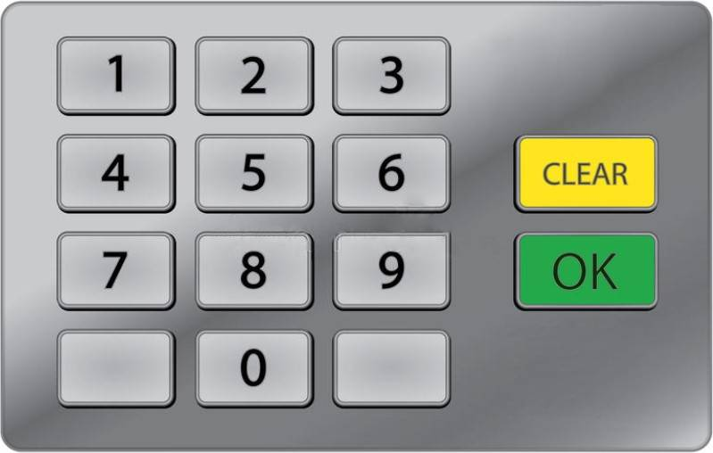
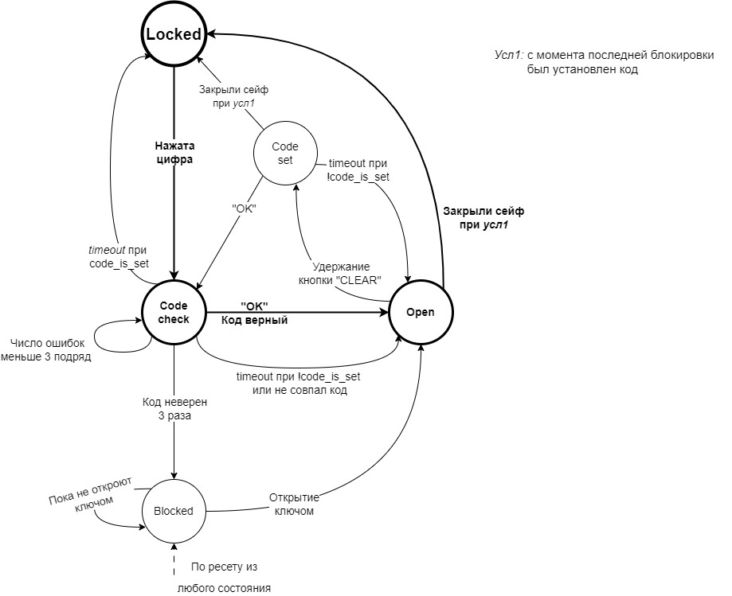

# План

1. Изучить [спецификацию](#описание-устройства)
2. Если появляются вопросы по специфицации, задать их организаторам
3. Составить [верификационный план](./doc/verification_plan.md)
4. Распределить задачи между участниками
5. Сделать fork
6. Написать [ассершены](./doc/assertions_review.md), провести моделирование
7. По результатам моделирования составить(обновить) [отчет](./doc/report.md)
8. По полученному отчету создать [презентацию](./doc/presentation.pptx)

Пример, как работать с репозиторием находится [ЗДЕСЬ](/doc/repository_work.md) (как сделать fork, pull request, моделирование)

# Распределение задач по дням хакатона

## 1 день

1. Организационные вопросы: регистрация, доступ к репозиторию, знакомство с инструментарием, создание форка.
2. Изучение спецификации устройства.
3. Составление верификационного плана, распределение задач плана между участниками.
4. Изучение ассершенов, пробное описание простых утверждений из плана.

## 2 день

1. Мастер-класс по ассершенам.
2. Реализация верификационного плана.
3. Проверка написанных ассершенов на эталонном описании устройства.

## 3 день

1. Завершение реализации тестового плана.
2. Поиск описаний устройства с ошибками посредством реализованных ассершенов.
3. Составление отчета.
4. Создание итоговой презентации.
5. Сдача отчета.
6. Презентация результатов.

# Задание

Перед вами содержимое данного вам репозитория. Сделайте его форк. Сам форк — склонируйте.  
В папке `rtl` вы можете найти эталонный проект устройства, спецификацию которого вы сможете прочесть ниже. В папке `tb` находится тестбенч, а так же модуль-заготовка, в котором вам необходимо дописать ассершены по спецификации на устройство, которые позволят убедиться в работоспособности как эталонного дизайна, так и множества других его реализаций, часть из которых содержит ошибки.  
Эталонный модуль устройства и тестбенч даны вам, чтоб вы могли отладить ваши ассершены до отправки их на проверку. Если во время симуляции эталонного модуля вы видите нарушение ассершена — значит скорее всего вы где-то ошиблись (правда возможно так же и то, что вы нашли ошибку в эталонном модуле). Вам необходимо править только модуль `tb/assertions.sv`, если вы будете создавать проект внутри данной папки, убедитесь, что вы не фиксируете файлы проекта.  
После того, как вы добавили ассершены, вам необходимо открыть `pull-request` — запустится автоматизированный запуск тестов. По окончанию тестирования вы сможете скачать архив с логами и времянками, по которым сможете понять на каких модулях сработали ваши ассершены, и проверить корректно ли они сработали. Ваша цель — найти как можно больше модулей с ошибками в коде посредством написанных вами ассершенов, и попытаться понять в чем заключается ошибка.  
Вы не знаете сколько есть ошибок. Вы не знаете есть ли они вообще. Вы не можете посмотреть на код модулей. Дерзайте!


# Описание устройства
Имеется сейф со следующим прототипом:
 ```SystemVerilog
module safe
#(
    parameter CODE_LENGTH = 4,
    parameter WRONG_ATTEMPS_TO_BLOCK = 3,
    parameter TIMEOUT_VALUE = 1000,
    parameter LONG_PRESS_VALUE = 100
)
(
    input 
            logic       clk_i,
            logic       arst_n_i,

    /* Input interface */
    input
            data_in     data_in_i,
            logic       data_in_valid_i,
    output  logic       data_in_ready_o,

    /* Mechanical unlock interface */
    input
            logic       unlock_i,
            logic       unlock_valid_i,
    output  logic       unlock_ready_o,

    /* Output interface */
    output
            data_out    data_out_o,
            logic       data_out_valid_o,
    input   logic       data_out_ready_i

);
```


Панель сейфа имеет 13 кнопок: цифры 0 - 9 , кнопка подтверждения “OK” и кнопка “CLEAR”. 

В процессе работы, в соответствии с диаграммой состояний, может быть 3 сценария:

1. Основной режим работы

    Пользователь вводит правильный пароль, после чего сейф открывается. Можно ввести неправильный пароль до двух раз подряд, если ввести 3 раз, сейф заблокируется. Для завершения сценария необходимо закрыть сейф.
    

2. Смена пароля

    Когда сейф открыт, при удерживании клавиши “CLEAR”, сейф переходит в состояние смены пароля `CODE_SET`. Пользователю необходимо ввести пароль, нажать кнопку “OK”, повторно ввести пароль для подтверждения и нажать “OK”. Если пароли совпадают, произойдет смена пароля, в ином случае сценарий придется повторить.

    При длительном бездействии(timeout) происходит прекращение работы .


3. Блокировка, отключения питания

  Если пароль был неправильно введен 3 раза подряд, или было отключено питание, то сейф переходит в состояние `BLOCKED`. Выход из этого состояния происходит с помощью физического ключа.  


`Важно!`  
После открытия двери физическим ключом необходимо произвести смену пароля. В противном случае запереть сейф не удастся.

# Переходы конечного автомата между состояниями



* Автомат находится в состоянии `LOCKED`:
    * В случае нажатии кнопки → переход в состояние `CODE_CHECK`
    * В противном случае, сейф остается в состоянии `LOCKED`  
&nbsp;

* Автомат находится в состоянии `CODE_CHECK`:
    * В случае ввода верного кода → переход в состояние `OPEN`
    * В случае ввода неверного кода 3 раза подряд → переход в состояние `BLOCKED`
    * В случае `timeout` при `code_is_set` → переход в состояние `LOCKED`
    * В случае `timeout` при `!code_is_set` → переход в состояние `OPEN`
    * В противном случае, сейф остается в состоянии `CODE_CHECK`  
&nbsp;  

* Автомат находится в состоянии `OPEN`:
    * В случае закрытия сейфа при `усл1` → переход в состояние `LOCKED`
    * В случае удержания кнопки “CLEAR” [LONG_PRESS_VALUE](#параметры) тактов → переход в состояние `CODE_SET`
    * В противном случае, сейф остается в состоянии `OPEN`  
&nbsp;  

* Автомат находится в состоянии `CODE_SET`:
    * В случае ввода кода и нажатия кнопки “OK” → переход в состояние `CODE_CHECK`
    * В случае закрытия двери при `усл1` → переход в состояние `LOCKED`
    * В случае `timeout` → переход в состояние `OPEN`
    * В противном случае, сейф остается в состоянии `CODE_SET`  
&nbsp;  

* Автомат находится в состоянии `BLOCKED`:
    * В случае открытия механическим ключом → переход в состояние `OPEN`
    * В противном случае, сейф остается в состоянии `BLOCKED`
&nbsp;  


`усл1` : с момента последней блокировки был установлен код

# Действия, производимые автоматом в различных состояниях

## Состояние CODE_CHECK

В данном состоянии производится ввод пароля или подтверждение смены пароля.

Попадание в состоянии `CODE_CHECK` производится по двум сценариям:

1. Из состояния `LOCKED`
    В данном случае, при нажатии "OK", введенный пароль `current_input` сравнивается с паролем из регистра `current_pass` 

2. Из состояние `CODE_SET`
    В данном случае, при нажатии "OK", `code_is_set` уходит в 1, введенный пользователем пароль `current_input` сравнивается с регистром `new_pass`, заданном в `CODE_SET`. При совпадении паролей, `new_pass` записывается в `current_pass`.

При бездействии `TIMEOUT_VALUE` тактов в обоих случаях происходит `timeout`.

## Состояние OPEN

Из данного состояния возможны два действия:

1. Закрыть дверь сейфа, при условии, что `code_is_set == 1`
2. Удерживать кнопку “CLEAR” `LONG_PRESS_VALUE` тактов  для перехода в состояние смены пароля.

## Состояние CODE_SET

Если пользователь закрыл дверь сейфа при:

1. `code_is_set == 1`  
Смена пароля отменяется, сейф закрывается и переходит в состояние `LOCKED`
2. `code_is_set == 0`  
У пользователя есть время до `timeout` ввести новый код и нажать "OK", иначе выполнится переход в `OPEN`

При нажатии "OK", `code_is_set` уходит в 0.


## Состояние BLOCKED

Выйти из данного состояния возможно только с помощью открытия двери сейфа механическим ключом.

## Сигнал сброса

При отключении питания происходит `arst_n_i` и автомат уходит в состояние `BLOCKED`, вне зависимости от того, в каком состоянии он был. 

## Пароль

Максимальная длина пароля равна параметру `CODE_LEN`. Можно установить пароль меньшей длины, тогда остаток будет заполнен нулями.


# Параметры

 ```SystemVerilog
    parameter CODE_LENGTH = 4,
    parameter WRONG_ATTEMPS_TO_BLOCK = 3,
    parameter TIMEOUT_VALUE = 1000,
    parameter LONG_PRESS_VALUE = 100
```

- `CODE_LENGTH` - длина кода для открытия сейфа
- `WRONG_ATTEMPS_TO_BLOCK` - число неверных попыток, до блокировки сейфа
- `TIMEOUT_VALUE` - число тактов для определения, что с сейфом не взаимодействуют
- `LONG_PRESS_VALUE` - число тактов для определения длительного нажатия на кнопку


# Архитектурные регистры

[Что такое clog2?](#clog2)

## state
 ```SystemVerilog
typedef enum logic [2:0] {
    LOCKED          = 3'd0,
    CODE_CHECK      = 3'd1,
    OPEN            = 3'd2,
    CODE_SET        = 3'd3,
    BLOCKED         = 3'd4
} safe_state;
```
Переход между состояниями организован в соответствии с графом переходов в спецификации.

## data_in
 ```SystemVerilog
typedef enum logic [3:0] {
    KEY_0           = 4'h0,
    KEY_1           = 4'h1,
    KEY_2           = 4'h2,
    KEY_3           = 4'h3,
    KEY_4           = 4'h4,
    KEY_5           = 4'h5,
    KEY_6           = 4'h6,
    KEY_7           = 4'h7,
    KEY_8           = 4'h8,
    KEY_9           = 4'h9,
    KEY_CLEAR       = 4'hA,
    KEY_OK          = 4'hB,
    DOOR_SEALED     = 4'hC
} data_in;
```
Перечисление `data_in` определяет набор значений для кнопок, которые используются для управления сейфом. Каждое значение представляет собой кнопку с уникальным номером, например, KEY_0, KEY_1, KEY_2, и т.д.

## data_out
 ```SystemVerilog
typedef enum logic[2:0] {
    PASS_OK         = 3'h0,
    PASS_FAIL       = 3'h1,
    DOOR_LOCK       = 3'h2,
    BLOCK           = 3'h3,
    TIMEOUT         = 3'h4,
    CODE_SET_MODE   = 3'h5
} data_out;
```
Перечисление `data_out` определяет набор значений для выходных сигналов, которые используются для управления сейфом.

## code_reg
 ```SystemVerilog
typedef logic [CODE_LENGTH-1:0][3:0] code_reg;
```
Новый тип данных, который представляет собой двумерный массив из 4-битных логических значений  
[см. CODE_LENGTH](#параметры)


## code_is_set
 ```SystemVerilog
logic code_is_set;
```
Флаг, указывающий, что сейф имеет установленный пароль. Сбрасывается при попадании в состояние `BLOCKED`


## wrong_attemps
 ```SystemVerilog
logic [$clog2(WRONG_ATTEMPS_TO_BLOCK-1):0] wrong_attemps;
```
Хранит число неправильных попыток ввода пароля. Сбрасывается при вводе правильного пароля. Доступ из состояния `CODE_CHECK`  
[см. WRONG_ATTEMPS_TO_BLOCK](#параметры)


## current_input, current_pass, new_pass;
 ```SystemVerilog
code_reg current_input, current_pass, new_pass;
```
Регистры, для хранения:  
1. `current_input` - вводимого пользователем пароля. При нажатии “CLEAR” полностью очищается.
2. `current_pass` - пароля, установленного в сейфе. Читается только в состоянии `CODE_CHECK`
3. `new_pass` - нового пароля, введенного в состоянии смены пароля `CODE_SET`. Запись производится в состоянии `CODE_SET` при нажатии кнопки “OK”.

[см. code_reg](#code_reg)


## current_input_cnt
 ```SystemVerilog
logic [$clog2(CODE_LENGTH):0] current_input_cnt;
```
Счетчик, подсчитывающий количество введенных цифр пароля. Максимальное число счетчика равно параметру [CODE_LENGTH](#параметры)


## clear_long_press_cnt
 ```SystemVerilog
logic [$clog2(LONG_PRESS_VALUE):0] clear_long_press_cnt;
```
Счетчик для определения длительного нажатия на кнопку "CLEAR". Длительность задается параметом [LONG_PRESS_VALUE](#параметры)


## timeout_cnt
 ```SystemVerilog
logic [$clog2(TIMEOUT_VALUE):0] timeout_cnt;
```
Счетчик [TIMEOUT_VALUE](#параметры) тактов. Используется для определения бездействия в состояниях `CODE_CHECK` и `CODE_SET`
 ([см переходы состояний](#переходы-конечного-автомата-между-состояниями))


# Дополнительная информация
## clog2
Функция `clog2` в языке SystemVerilog используется для вычисления целочисленного логарифма по основанию 2 с округлением вверх. С помощью этой функции можно узнать сколько бит необходимо для хранения данного числа.

Например, 
 ```SystemVerilog
    example1 = clog2(14);   // = 4
    example2 = clog2(16);   // = 4
    example3 = clog2(17);   // = 5
```

- `example1` будет равен 4, т.к. для 14 значений хватит 4 бит 

- `example2` также будет равен 4.

- `example3` будет равен 5, т.к. для 17 значений понадобится 5 бит  

&nbsp;

В нашем случае для счетчика `clear_long_press_cnt`
 ```SystemVerilog
reg [ clog2(150) - 1 :0] clear_long_press_cnt;
```
преобразуется в 
 ```SystemVerilog
reg [ 8 - 1 :0] clear_long_press_cnt;
```
Для счетчика до 150 хватит 8 бит.
